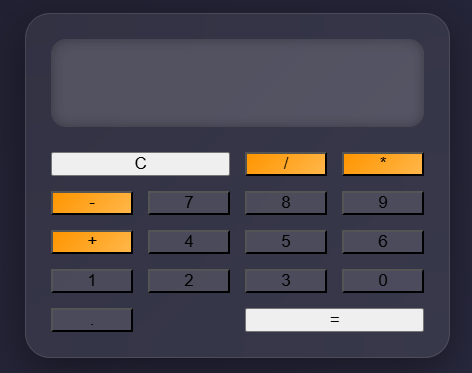

# Calculator App

 <!-- Replace with actual screenshot path -->

## Overview

This is a **JavaScript-based calculator** featuring a modern, interactive design.  
It allows users to perform basic arithmetic operations including addition, subtraction, multiplication, and division.  
The UI is designed with **glassmorphism**, hover effects, and a responsive grid layout for a polished, user-friendly experience.

---

## 🔹 Features

- Perform **basic arithmetic operations**: `+`, `-`, `*`, `/`  
- Clear current input using the **C** button  
- **Equals** button computes the result of the current operation  
- Supports **decimal numbers**  
- Responsive and interactive **glassmorphism UI**  
- Hover effects for buttons to enhance UX  
- Grid layout with special positioning for `C` (spans two columns) and `=` (spans last two columns at bottom)  

---

## 💻 Technologies Used

- HTML5  
- CSS3 (Grid, Flexbox, Glassmorphism, Hover Effects)  
- JavaScript (ES6)  
- Responsive Design Principles  

---

## 🚀 Getting Started

### 1. Clone the Repository
```bash
git clone https://github.com/yourusername/calculator-app.git
